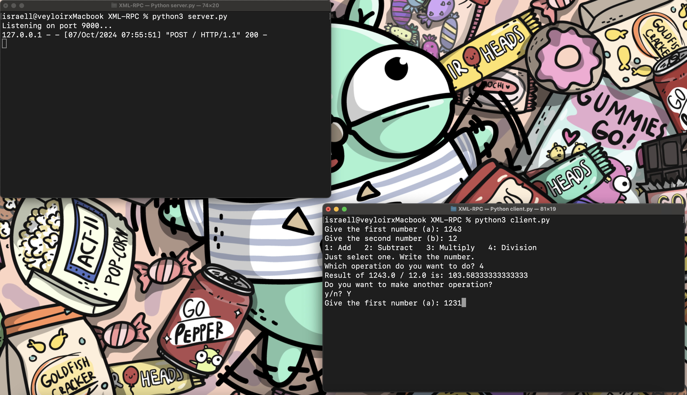

# Calculadora en Python Usando XML-RPC

Este documento explica cómo crear una calculadora simple usando el protocolo ```XML-RPC``` en Python. La calculadora puede realizar operaciones aritméticas básicas: suma, resta, multiplicación y división.

## Guía SERVIDOR 

### Aqui la explicacion paso a paso del codigo del cliente (server.py)


### Importar la Biblioteca necesaria

Comienza importando la clase `SimpleXMLRPCServer` del módulo `xmlrpc.server`.

```python 
from xmlrpc.server import SimpleXMLRPCServer
``` 

### Deficinar funciones de calculo 

Definimos las funciones que realizarán las operaciones aritméticas.
Todas las funciones con las cuatro operaciones basicas de la aritmetica, toman como argumento dos parametros y devuelven un producto de estos.

```python
def add_numbers(a, b):
    return a + b
``` 

### Creamos el servidor

Crea una instancia del servidor XML-RPC y configura el puerto donde escuchará las solicitudes.

```python
server = SimpleXMLRPCServer(('localhost', 9000))
```

Se deben registrar las funciones que se desean exponer a los clientes.

```python  
server.register_function(add_numbers, 'add')
server.register_function(rest_numbers, 'rest')
server.register_function(mul_numbers, 'mul')
server.register_function(div_numbers, 'div')
```
Estas líneas registran las funciones aritméticas con el servidor, asignándoles un nombre que los clientes pueden usar para llamarlas.

### Iniciamos el servidor 

```python
server.serve_forever()
```
Este método pone el servidor en un bucle infinito, escuchando y procesando solicitudes de clientes hasta que el programa se detiene.

OPCIONALMENTE se puede imprimir un mensaje en consola para indicar que el servidor se encuentra activo. 
```python
print("Listening on port 9000...")
```

Una vez ejecutado. el servidor esta listo para escuchar peticiones desde uno o mas clientes. 

## Guía CLIENTE

### Aqui la explicacion paso a paso del codigo del cliente (client.py)

### 1.  Importar la Biblioteca Necesaria

Primero, importa la biblioteca `xmlrpc.client`, que te permite comunicarte con un servidor ```XML-RPC```.

```python
import xmlrpc.client
```

### Creamos la funcion main 

```python
def main():
    proxy = xmlrpc.client.ServerProxy("http://localhost:9000/")
```
En ella, creamos un objeto proxy que se conecta al servidor ```XML-RPC``` que se ejecuta en localhost en el ```puerto 9000```.


### Definir la funcion de operaciones

```python
def switch_operation(proxy):
    flag = True
    while flag:
```
La función ```switch_operation()``` toma el proxy como argumento.
Se inicializa una variable ```flag``` en ```True``` para controlar un bucle while, el cual sera el bucle principal del cliente. 
El bucle se ejecutara siempre que ```flag``` sea verdadero, es decir, tendremos que detener su ejecucion para terminar el proceso, y esto solo se lograra cambiando ```flag``` a ```False```.

### Manejo de entradas del usuario

```python
try: 
    number_a = float(input("Give the first number (a): "))
    number_b = float(input("Give the second number (b): "))
```
Usamos try para manejar excepciones. Se solicitan dos números al usuario y los parseamos a tipo float.
Recordemos que el input toma por defecto en tipo string, por ello es importante el parseo. 

### Mostrar opciones de operacion

```python
    print("1: Add   2: Subtract   3: Multiply   4: Division")
    print("Just select one. Write the number.")
    operation = int(input("Which operation do you want to do? "))
```
Se imprimen las opciones para que el usuario elija. La entrada del usuario se convierte a un número entero para determinar la operacion.

### Seleccion de operacion

```python
if operation == 1:
    result = proxy.add(number_a, number_b)
    print(f"Result of {number_a} + {number_b} is: {result}")
```
Dependiendo del valor de ```operation```, se llama al metodo correspondiente desde el proxy ```(add, rest, mul, div)```. Los metodos del proxy devuelven (como ya vimos en la configuracion del server), el resultado de una operacion determinada. 

El valor devuelto de dicha operacion, se almacena en la variable ```result```. Y es impresa en consola junto con los valores dados por el usuario, por supuesto, debidamente formateados.
Imitamos el comportamiento de un ```switch``` con una de cadena de ```elif```, con la misma declaracion para cada caso, solo haciendo una excepcion en el caso de una division, puesto que debemos validar la division entre 0. 

```python
elif operation == 4:
    if number_b == 0:
        print("Error: Division by zero is not allowed.")
    else:
        result = proxy.div(number_a, number_b)
        print(f"Result of {number_a} / {number_b} is: {result}")
```

### Continuacion o cierre del bucle principal 

Preguntamos al usuario si desea hacer otra operacion

```python
    print("Do you want to make another operation?")
```

Creamos otro bucle para controlar la salida del bucle principal.

```python
flag_keep = True
while flag_keep:
    keep = input("y/n? ").lower()  
    if keep == "y":
        flag = True
        flag_keep = False  
    elif keep == "n":
        flag = False
        flag_keep = False 
    else:
        print("You did not choose a valid option. This isn't the way.")
        flag_keep = True  
```
```flag_keep``` es una variable booleana utilizada para validar la entrada del teclado, para asegurar que el usuario solo introduzca ```y``` o ```n```. Inmediatamente al recibirse se convierte a minusculas, para evitar excepciones. 
Una cadena de ```elif``` se encarga de validar la entrada. 
Mantenemos ```flag``` en ```True``` si la respuesta del usuario es positiva, de ser negativa hacemos el cambio a ```False```, para detener el bucle principal. 
De ingresar cualquier otro dato, se imprimira un mensaje indicando que se ha ingresado una opcion invalida, y volver a iniciar el bucle. 

### Manejo de excepcion

```python 
 except ValueError:
            print("Please, write correct numbers.")
```
Si se produce un error de conversión al intentar convertir la entrada a float o int, se captura la excepción y se imprime un mensaje pidiendo al usuario que ingrese números válidos.

### Llamamos nuestra funcion de operaciones desde el main 

Ya hemos creado nuestro metodo main, ahora debemos modificarlo para llamar la funcion de operaciones, y pasarle el proxy por parametro. 

```python 
def main():
    proxy = xmlrpc.client.ServerProxy("http://localhost:9000/")
    switch_operation(proxy)
```

### Por ultimo

```python
if __name__ == "__main__":
    main()
```

Ejecutamos el metodo main.
Esta línea asegura que main() se ejecute solo si el script se ejecuta como el programa principal, ```y no cuando se importa como un módulo``.

Una vez ejecutado el cliente y servidor, podremos hacer operaciones basicas desde el cliente, siempre que el servidor este funcionamiento. 





Esta es la forma practica de manejar un cliente y servidor en ```XML-RPC```. 


